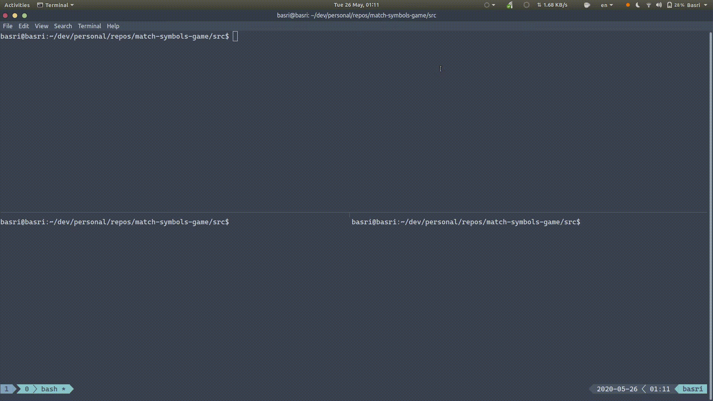

# Match Symbols Game with Python Coroutines

This repository contains the source code of a very simple game. The game is played by 2 people in turns. There is a deck of symbols and initially all symbols are closed. Each player opens 2 cells on her turn. If both cells have the same symbol, the player’s score is incremented and the player opens 2 other cells. Otherwise, it becomes the other player’s turn. The game is completed when either one of the players manages to match more than half of the symbols, or both match the same number of symbols, which is a tie.

The game is played via a simple and text-based TCP server. The game server supports an arbitrary number of players. Since the game is for 2 players, the game server pairs connecting players in the FIFO order. When a player joins the server, she will wait in the lobby until another player chimes in. When a player disconnects during the game, the other player returns back to the lobby. Games and communication with connected clients are handled with coroutines.

I am mostly done with the development of this game for now. It is available here with the MIT license in case other Python developers may find it interesting or useful. So, have fun!


## Demo

You can see a quick demo below. In this demo, I start a game server with the default settings, then connect 2 TELNET clients. When the first client connects, it waits for another client to join. When the second client chimes in, the game starts. Each client opens 2 cells on its turn. After some time, one of the clients just disconnect and the other client goes back to the lobby. 




## Try it yourself

You can start the game server as below. It binds to `localhost:10670` by default. Make sure you have Python 3.7+. 

```
git clone https://github.com/metanet/match-symbols-game.git
cd match-symbols-game 
pip install -r requirements.txt
python3 src/game_server.py
```

Once the server is up and running,  you can connect to it with  `telnet localhost 10670`. If you want to disconnect your TELNET client,  press `CTRL+]`, then type `close`. It is shown in the demo above.


## How does it work?

See <a href="https://basri.dev/posts/2020-05-27-writing-a-simple-game-with-python-coroutines-match-symbols/" target="_blank">my blog post</a>. 